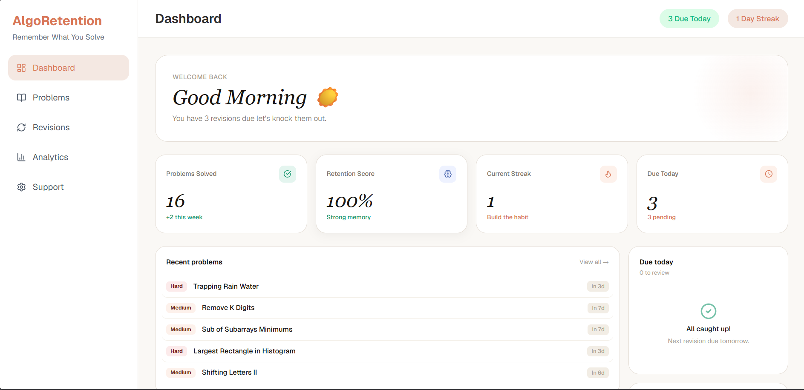
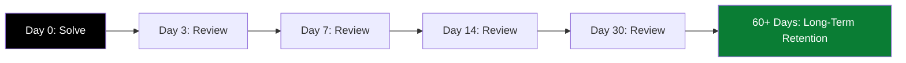
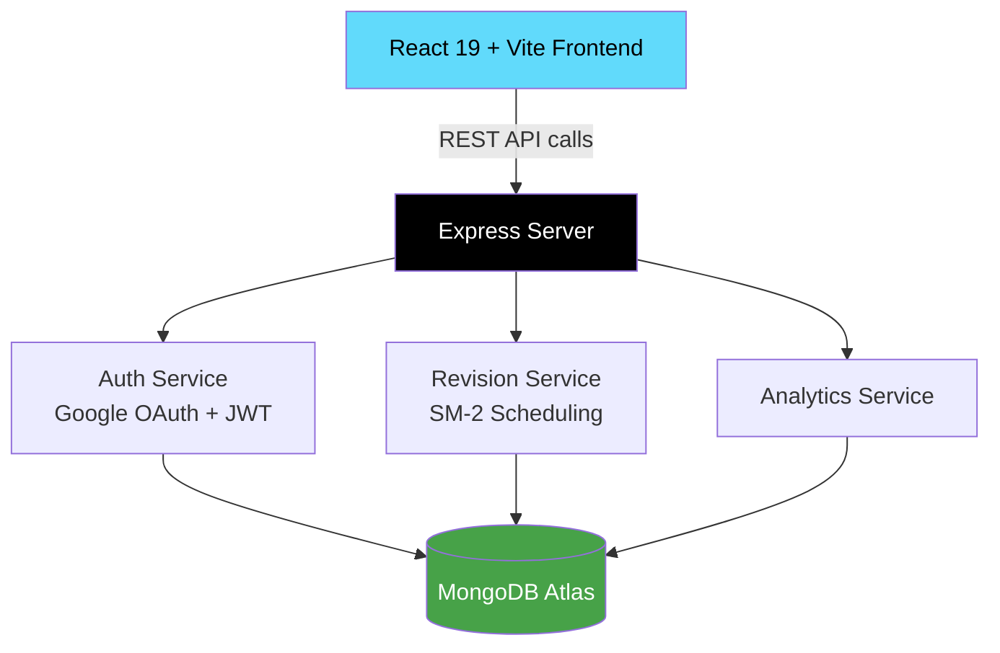
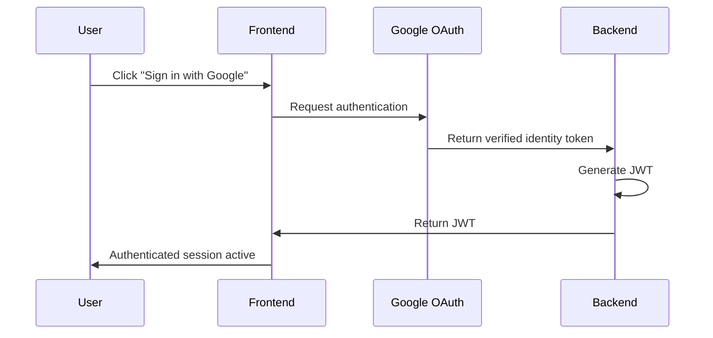
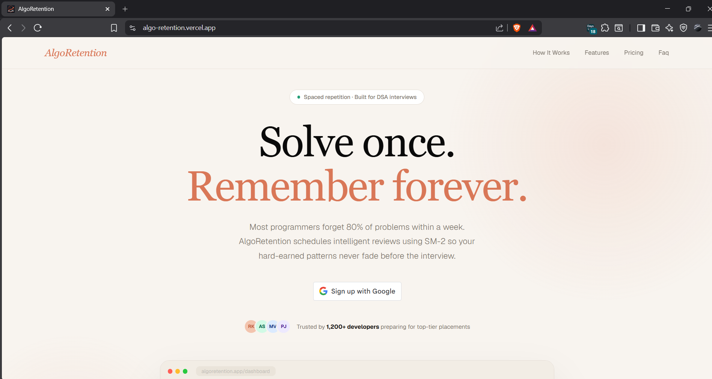
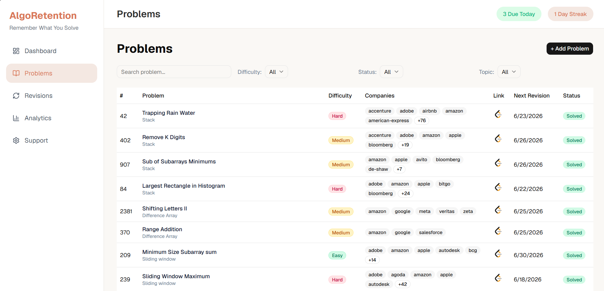
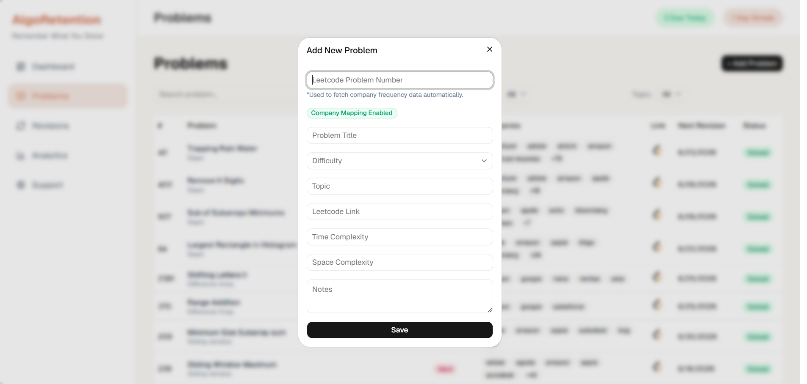
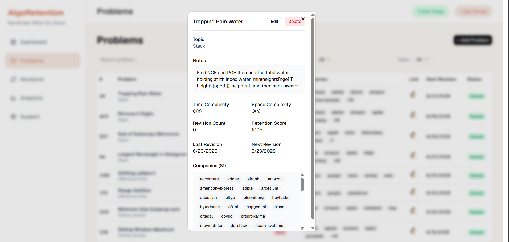
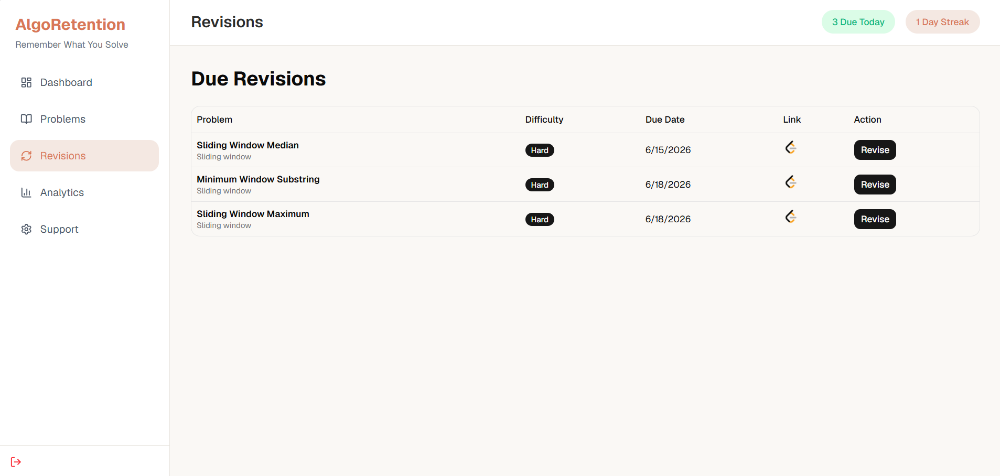
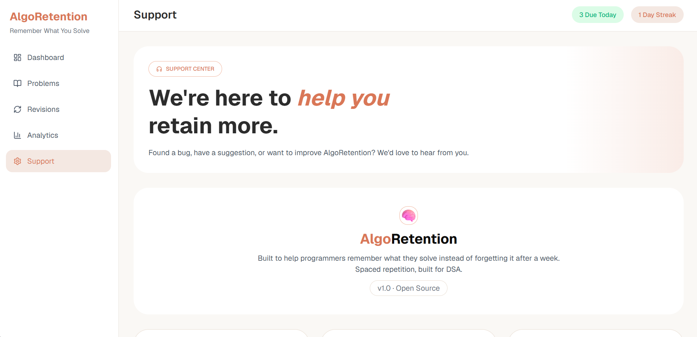

<div align="center">


# AlgoRetention

### Solve Once. Remember Forever.

**The spaced-repetition engine that stops you from re-learning the same LeetCode problem three times before an interview.**

<p align="center">
  <a href="https://algo-retention.vercel.app"></a>
</p>

<p align="center">
  
  
  
  
</p>

<p align="center">
  
  
  
  
  
  
  
</p>

</div>

<br/>

<div align="center">

<p><i>Your DSA prep, condensed into one number: how much of it you'll actually remember.</i></p>
</div>

<br/>

## The Problem

Most candidates solve 300-500 LeetCode problems before interviews and forget 60-70% of them within two weeks. The Ebbinghaus forgetting curve doesn't care how confident you felt when you submitted a solution. Without a revision system, "I've solved this before" silently becomes "I have no idea how to start this" by the time the actual interview happens.

**AlgoRetention turns problem-solving into a tracked, scheduled, measurable retention system** built on spaced repetition principles, the same backbone behind Anki and SuperMemo.

| Without AlgoRetention | With AlgoRetention |
|---|---|
| Solve → feel confident → forget | Solve → log → auto-scheduled revision → retained |
| Random, anxiety-driven revision | Data-driven revision queue, sorted by urgency |
| No idea which topics are weak | Retention Score flags exactly where you're vulnerable |
| Re-solving problems from scratch | Recall-based review in a fraction of the time |

<br/>

## Core Features

**Spaced Repetition Engine** Every solved problem is automatically scheduled for review using interval logic inspired by the SM-2 algorithm, increasing the gap between revisions as recall strength improves.

**Company Frequency Mapping** Enter a LeetCode question number and instantly see which companies (Amazon, Google, Microsoft, Meta, Uber, and 300+ others) have asked it so prep time goes where it statistically matters most.

**Retention Score** A live score per problem and per topic, built from revision consistency and recall quality, that tells you exactly which patterns are fading before an interviewer finds out.

**Revision Dashboard** One queue: what's due today, what's coming up, and your streak no spreadsheets, no guessing.

**Secure Google OAuth + JWT Auth** One-click sign-in with persistent, protected sessions.

**Fully Responsive UI** Built mobile-first; works identically on desktop, tablet, and phone.

<br/>

## How the Revision Engine Works



Each successful recall pushes the next review further out. Each failed recall pulls it back in. The schedule adapts to *your* memory, not a fixed calendar.

<br/>

## Engineering Highlights

This isn't a CRUD wrapper a few things under the hood that took real design decisions:

- **Adaptive scheduling logic** (SM-2 inspired) that recalculates next-review dates per problem based on recall outcome, not a static timer
- **Normalized MongoDB schema** across User, Problem, Revision, and Company-Mapping collections via Mongoose, keeping revision history and company data queryable without duplication
- **Google OAuth 2.0 + JWT** authentication with protected routes and persistent sessions on the frontend
- **REST API in Express**, cleanly separated into controllers/services/middleware, deployed serverless on Vercel with MongoDB Atlas as the managed data layer
- **React 19 + Vite** frontend optimized for fast loads and a fully responsive layout across breakpoints

<br/>

## System Architecture



<br/>

## Authentication Flow



<br/>

## Product Tour

<div align="center">

**Landing Page**<br>


**Problem Library** search, filter, manage every solved problem


**Add Problem** log topic, difficulty, notes, complexities, and the LeetCode link


**Problem Details** notes, retention score, company mapping, and next revision date in one view


**Revision Queue** everything due today, generated automatically


**Support Page** Contacts of developers and FAQ section
<div>

</div>

</div>

<br/>

## Tech Stack

| Layer | Stack |
|---|---|
| Frontend | React 19, Vite, React Router DOM, Axios, Lucide React, Sonner Toasts, Shadcn/ui |
| Backend | Node.js, Express.js, JWT, Google OAuth |
| Database | MongoDB Atlas, Mongoose ODM |
| Deployment | Vercel, MongoDB Atlas Cloud |

<br/>

---

# 📁 Project Structure

```text
AlgoRetention
│
├── Frontend
│   │
│   ├── public
│   ├── src
│   │
│   ├── components
│   │   ├── analytics
│   │   ├── dashboard
│   │   ├── landing
│   │   ├── layout
│   │   ├── problems
│   │   ├── revision
│   │   ├── support
│   │   └── ui
│   │
│   ├── pages
│   ├── routes
│   ├── services
│   ├── context
│   └── utils
│
├── Backend
│   │
│   ├── config
│   ├── controllers
│   ├── middleware
│   ├── models
│   ├── routes
│   ├── services
│   └── utils
│
└── README.md
```

---

# 🔐 Authentication Flow

```text
User
  │
  ▼
Google OAuth
  │
  ▼
Backend Verification
  │
  ▼
JWT Generation
  │
  ▼
Protected Routes
```

## API Reference

```http
POST   /api/auth/google         # Authenticate via Google OAuth
GET    /api/auth/profile        # Get current user profile

GET    /api/dashboard           # Aggregated dashboard stats

GET    /api/problems            # List all problems
POST   /api/problems            # Add a new problem
PUT    /api/problems/:id        # Update a problem
DELETE /api/problems/:id        # Delete a problem

GET    /api/revisions           # Get due/upcoming revisions
POST   /api/revisions/:id       # Submit a revision outcome
```

<br/>

## Run It Locally

```bash
git clone https://github.com/ranjit-ux/AlgoRetention.git
cd AlgoRetention
```

**Frontend**
```bash
cd Frontend
npm install
npm run dev
```

**Backend**
```bash
cd Backend
npm install
npm run dev
```

**Frontend/.env**
```env
VITE_API_URL=
VITE_GOOGLE_CLIENT_ID=
```

**Backend/.env**
```env
PORT=
MONGODB_URI=
JWT_SECRET=
GOOGLE_CLIENT_ID=
```

<br/>

## Roadmap

**Shipped:** Google OAuth + JWT auth · problem tracking · spaced-repetition scheduling · company frequency mapping · support center · responsive UI · production deployment

**Next:** Email revision reminders · AI-generated revision suggestions · interview readiness score · topic mastery system · public profiles & leaderboards

<br/>

## Built By

**Ranjit Kumar Singh**
<br>
Electronics & Communication Engineering, National Institute of Technology Bhopal

[GitHub](https://github.com/ranjit-ux) · [LinkedIn](https://www.linkedin.com/in/ranjit-kumar-singh/) · [Website](https://ranjitkumarsingh.in/)

<br/>

<div align="center">

If this helped you think differently about how you prep, a ⭐ helps it reach more people solving the same problem.

<a href="https://algo-retention.vercel.app"></a>

</div>
